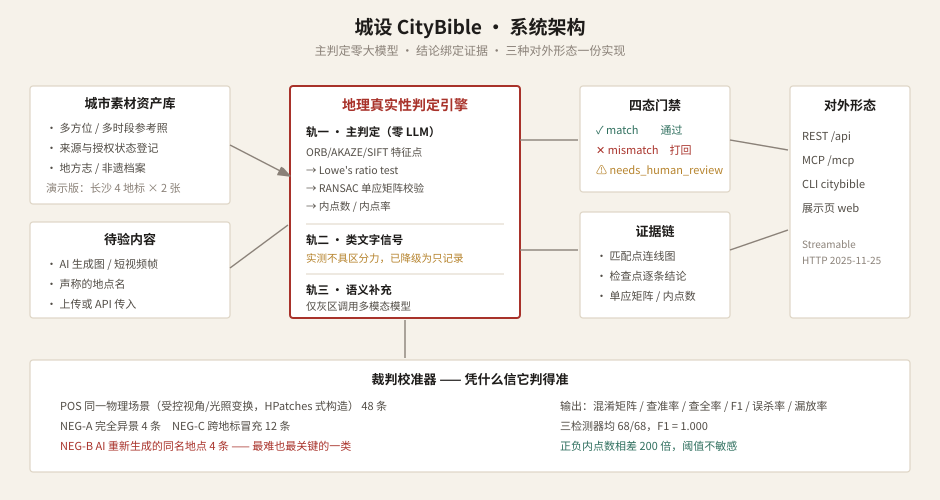

<p align="center">
  
</p>

<h1 align="center">城设 CityBible</h1>
<p align="center"><b>给每一座城市，写一本设定集</b></p>
<p align="center">城市文旅内容的真实素材资产库 · 地理真实性验真门禁 · REST / MCP / CLI 三形态开放</p>

<p align="center">
  <a href="http://47.119.112.225/citybible/"><b>在线体验</b></a> ·
  <a href="http://47.119.112.225/citybible/#video"><b>演示视频</b></a> ·
  <a href="docs/城设CityBible_演示视频.mp4">下载 MP4</a> ·
  <a href="docs/交付总文档.md">交付总文档</a> ·
  <a href="eval/calibration_report.json">校准报告</a> ·
  <a href="engine/verify.py">判定引擎</a>
</p>

<p align="center">
  
  
  
  
  
  
</p>

---

## 目录

- [这是什么](#这是什么)
- [演示视频（87 秒）](#演示视频87-秒)
- [最关键的一个发现](#最关键的一个发现)
- [核心技术](#核心技术)
- [校准报告](#校准报告凭什么信它判得准)
- [仓库结构](#仓库结构)
- [环境要求](#环境要求)
- [快速开始](#快速开始)
- [本地起服务](#本地起服务)
- [API 与 MCP](#api-与-mcp)
- [部署到服务器](#部署到服务器安全隔离)
- [复现全部指标](#复现全部指标)
- [已知局限](#已知局限)
- [合规与素材说明](#合规与素材说明)
- [License](#license)

---

## 这是什么

2026 年第一季度，全网新增上线微短剧约 **12.8 万部**，其中 **95% 以上有 AI 参与制作**。产能已经不是问题了。

但文旅内容和别的内容有一个根本区别——**它拍的是真实存在的地方**。一张看着像、其实不是岳麓书院的图发出去，对文旅局来说就是一次可被公众核查的事故。

所有工具都在解决「怎么生成得更快」。**城设解决的是：你生成的这个地方，现实中长这样吗。**

### 演示视频（87 秒）

| 入口 | 链接 |
|---|---|
| 在线播放 | http://47.119.112.225/citybible/#video |
| 直链 MP4 | http://47.119.112.225/citybible/media/demo.mp4 |
| 仓库内文件 | [`docs/城设CityBible_演示视频.mp4`](docs/城设CityBible_演示视频.mp4) |

画面全部为真实运行（Playwright 录展示页 + CLI 真实 stdout），真实运行画面约占 70%；旁白 MiniMax speech-2.6-hd，硬字幕，无 BGM。

| 模块 | 状态 | 说明 |
|---|---|---|
| 城市素材资产库 | 已实现 | 多方位参考照 + 来源与授权状态登记 |
| **地理真实性验真门禁** | **已实现** | 本项目技术核心 |
| 证据链 | 已实现 | 匹配点连线图 + 检查点 + 单应矩阵 |
| 裁判校准器 | 已实现 | 埋真值样本 → 混淆矩阵与全部指标 |
| REST / MCP / CLI | 已实现 | 一份领域逻辑，三种对外形态 |
| 到店归因 | 架构已设计 | 无真实核销数据，Demo 中不展示 |

**在线体验（免注册）：** http://47.119.112.225/citybible/

---

## 最关键的一个发现

用同一段提示词让 AI 再生成一次「岳麓书院」，人眼看着很像。但在几何上，它是一座**全新的建筑**：

| 待验图 | RANSAC 内点数 | 判定 |
|---|---:|---|
| 同一地点、另一时段与角度的拍摄 | **2355** | ✅ match |
| **AI 重新生成的「岳麓书院」** | **5** | ❌ mismatch |
| 完全异景（荒漠烽火台冒充天心阁） | 5 | ❌ mismatch |
| 跨地标（太平老街实照冒充岳麓书院） | 6 | ❌ mismatch |

**AI 生成的「岳麓书院」，和一个完全不相干的地方，在几何上没有区别。** 这就是文旅内容必须验真的直接理由——而且是实测撞出来的，不是编的。

---

## 核心技术

主判定链路**完全不调用大模型**：

```text
特征点检测 (ORB 默认)
  → 描述子暴力匹配
  → Lowe's ratio test (0.75)
  → RANSAC 估计单应矩阵 (重投影 5px, 置信度 0.995)
  → 内点数 / 内点率 → 四态门禁
```

同一输入任意次运行结果完全一致，可复现、可调参、可审计。匹配点连线图是判定过程的天然副产物，不需要额外设计解释模块。

### 为什么不用 CLIP 余弦相似度

「这张图是不是岳麓书院」属于 **instance-level recognition**，不是零样本分类。

1. **锥效应（cone effect）**：CLIP 图像 embedding 中，任意两张自然图像的余弦值天然落在 0.5–0.9 窄带，绝对阈值失去区分意义。
2. **Typographic attack**（arXiv:2103.10480）：图上贴一张写着目标名称的字条即可抬高相似度；文旅场景中水印、店招、打卡贴纸极其常见。

特征点 + RANSAC 没有这两个问题，且能指出「哪里像」。

### 主动砍掉的功能

原本设计了「类文字区域检测」防水印攻击。实测发现：

- 干净建筑照占比天然可到 **0.1%–15.2%**（屋瓦、梁枋的水平纹理被误判成文字行）
- 贴上水印后仅从 **4.08% → 9.12%**，落在正常范围内部

该检测器不具备区分力，已从门禁**降级为只记录不拦截**。保留一个会给出错误信心的功能，比没有更糟。

---

## 校准报告：凭什么信它判得准

难的不是做一个判定器，难的是凭什么信它。我们构造了 **68 条埋真值样本**，让引擎跑一遍：

| 检测器 | TP | FP | FN | TN | 查准率 | 查全率 | F1 | 误杀率 | 漏放率 | 平均耗时 |
|---|--:|--:|--:|--:|--:|--:|--:|--:|--:|--:|
| **ORB**（默认） | 48 | 0 | 0 | 20 | 1.000 | 1.000 | **1.000** | 0.000 | 0.000 | **254 ms** |
| AKAZE | 48 | 0 | 0 | 20 | 1.000 | 1.000 | 1.000 | 0.000 | 0.000 | 493 ms |
| SIFT | 48 | 0 | 0 | 20 | 1.000 | 1.000 | 1.000 | 0.000 | 0.000 | 2644 ms |

正样本内点数最低 **1393**，负样本最高 **7**——相差 **201 倍**。阈值不是恰好调对了，是方法本身稳。

```bash
python3 eval/calibrate.py     # 一条命令完整复现上表
```

校准集三类样本：

| 类别 | 构造方式 | 真值 |
|---|---|---|
| POS | 同底图受控视角/光照变换（HPatches 式） | match |
| NEG-A | 完全不同地点 / 跨地标 | mismatch |
| NEG-B | AI 用同名提示词重新生成 | mismatch |

---

## 仓库结构

```text
citybible/
├── engine/verify.py           # 判定引擎（选型论证写在源码注释里）
├── eval/
│   ├── calibrate.py           # 裁判校准器
│   └── calibration_report.json
├── assets/
│   ├── reference/             # 各地标参考照
│   ├── candidate/             # 演示用待验图（含 AI 同名重生负样本）
│   ├── variant/               # 正样本变体（可 scripts/make_variants.py 重建）
│   ├── evidence/              # 证据图
│   └── manifest.json
├── server/
│   ├── core.py                # 领域逻辑 + MCP 分发（零第三方依赖）
│   ├── app.py                 # FastAPI 薄封装
│   └── simple_server.py       # 标准库兜底服务器
├── cli/citybible.py           # 命令行工具（断网降级路径）
├── web/                       # 单文件展示页（数据内联）
├── scripts/                   # 素材生成 / 页面构建 / 申报表生成
├── docs/                      # 交付总文档 · 申报表 · 图表 · 分镜脚本
├── deploy.sh                  # 一键部署（端口避让 + 影响面比对 + 回滚）
├── requirements.txt
└── .env.example               # 仅模板，无真实密钥
```

---

## 环境要求

| 项 | 最低要求 |
|---|---|
| Python | 3.10+ |
| 系统 | macOS / Linux（Windows 可用 WSL） |
| 核心依赖 | `opencv-python-headless`、`numpy` |
| 可选依赖 | `fastapi`、`uvicorn`（装不上会自动切标准库模式） |
| 硬件 | 判定单次约 250ms（2 核 CPU）；无需 GPU |

---

## 快速开始

```bash
git clone https://github.com/bcefghj/citybible.git
cd citybible

python3 -m venv .venv
source .venv/bin/activate          # Windows: .venv\Scripts\activate
pip install -r requirements.txt    # 或至少：pip install opencv-python-headless numpy

# 若 assets/variant/ 只有 json、没有 jpg，先重建正样本：
python3 scripts/make_variants.py

# 列出资产库中已收录的地点
python3 cli/citybible.py landmarks

# 验证一张图（同景 / AI 重生 / 异景 均可试）
python3 cli/citybible.py verify assets/candidate/yuelu_academy_match.jpg --claim 岳麓书院
python3 cli/citybible.py verify assets/candidate/yuelu_academy_mismatch.jpg --claim 岳麓书院
```

CLI 常用子命令：

```bash
python3 cli/citybible.py landmarks
python3 cli/citybible.py verify <图片路径> --claim <地点名> [--detail full|summary]
python3 cli/citybible.py asset --landmark 岳麓书院
```

---

## 本地起服务

优先 FastAPI（有自动 `/api/docs`）；装不上时用标准库模式，REST + MCP 功能完整：

```bash
# 方式 A：FastAPI
uvicorn server.app:app --host 127.0.0.1 --port 8768

# 方式 B：标准库兜底
python3 -m server.simple_server --host 127.0.0.1 --port 8768
```

打开：

| 地址 | 说明 |
|---|---|
| http://127.0.0.1:8768/ | 展示页 |
| http://127.0.0.1:8768/api/health | 健康检查 |
| http://127.0.0.1:8768/api/docs | OpenAPI 文档（仅 FastAPI 模式） |
| http://127.0.0.1:8768/api/landmarks | 地点列表 |
| http://127.0.0.1:8768/mcp | MCP Streamable HTTP 端点 |

复制 `.env.example` 为 `.env` 可按需填写密钥；**判定引擎不依赖任何外部 API**，不填也能完整跑。

---

## API 与 MCP

### REST

```bash
# 健康检查
curl http://127.0.0.1:8768/api/health

# 上传验真
curl -X POST http://127.0.0.1:8768/api/verify \
  -F "file=@assets/candidate/yuelu_academy_match.jpg" \
  -F "landmark=岳麓书院" \
  -F "detail=full"
```

主要路由：`/api/health` · `/api/landmarks` · `/api/asset` · `/api/cases` · `/api/calibration` · `/api/verify`

### MCP（Streamable HTTP）

任何支持 MCP 的 Agent 填一个 URL 即可调用：

```bash
claude mcp add --transport http citybible http://<host>/citybible/mcp \
  --header "Authorization: Bearer $CITYBIBLE_API_TOKEN"
```

| Tool | 作用 |
|---|---|
| `verify_geo_fidelity` | 验真；默认约 200 token 摘要，`detail=full` 返回证据链 |
| `list_landmarks` | 列出已收录地点 |
| `query_city_asset` | 查询某地点素材与授权状态 |

选 Streamable HTTP 而非 stdio / 已废弃的 HTTP+SSE：MCP 规范自 2025-03-26 起以前者取代后者；火山方舟 Responses API 与 Google Gemini API 均只支持 Streamable HTTP。

线上公网路径（已部署）：

- 展示页：http://47.119.112.225/citybible/
- API：http://47.119.112.225/citybible/api/health
- 文档：http://47.119.112.225/citybible/api/docs
- MCP：http://47.119.112.225/citybible/mcp

---

## 部署到服务器（安全隔离）

面向「一台机器、多个项目互不影响」的约定：

```bash
sudo bash deploy.sh              # 部署
sudo bash deploy.sh --uninstall  # 干净卸载（保留代码目录）
```

`deploy.sh` 的安全承诺（脚本内均有对应实现）：

1. **自动挑空闲端口**：从 `8766` 起往上扫，`ss` + Python 试绑双保险，绝不抢占已监听端口  
2. **部署前后比对**：全部 systemd 服务与监听端口逐条 diff，有丢失即报警  
3. **nginx 只追加**：只写入 `# >>> CityBible BEGIN … END` 段，改前备份，`nginx -t` 不过立即回滚  
4. **目录隔离**：只创建 `/opt/projects/citybible` 与 `/var/www/citybible`  
5. **资源上限**：systemd `MemoryMax=700M`、`CPUQuota=140%`，避免挤垮同机其他项目  
6. **依赖兜底**：装不上 FastAPI 时自动切标准库模式  

当前生产实例端口为 `127.0.0.1:8768`（`8766`/`8767` 已被其他项目占用）。

---

## 复现全部指标

```bash
# 1) 重建正样本变体（若仓库里已有 jpg 可跳过）
python3 scripts/make_variants.py

# 2) 跑三检测器完整校准
python3 eval/calibrate.py

# 3) 查看报告
cat eval/calibration_report.json | python3 -m json.tool | less
```

图表与展示页可由脚本重生成：

```bash
python3 scripts/build_demo_cases.py
python3 scripts/build_web.py
```

---

## 已知局限

这几条是实测中确实存在的问题，写在这里而不是藏起来。

1. **校准集的正样本是合成的，不是实拍。** 采用 HPatches / Oxford-Affine 标准构造法。报告证明的是方法在受控条件下分离度极大、阈值不敏感，**不是**在真实二次实拍上准确率 100%。
2. **类文字区域检测器已主动降级。** 见上文「主动砍掉的功能」。
3. **只能验证参考库中已收录的地点。** 覆盖不足时真实照片也可能被判 mismatch。提升手段：每地点至少 4 方位 × 3 时段 × 2 季节。
4. **到店归因尚未接入真实数据。** 架构已设计，Demo 中不展示，以免与真实跑出的判定结果混淆。

---

## 合规与素材说明

- 演示素材全部由 AI 生成（火山方舟 Seedream），不含第三方版权图片、不含可识别自然人肖像。
- 仓库仅提供 `.env.example`，**不含任何真实密钥**。
- 开发过程使用了 AI 编程工具辅助；全部代码经运行、核对与演示验证；文中数值均由仓库内脚本实际跑出，可复现。
- 本项目明确不重复建设马栏山微短剧智能服务平台已提供的合规审核、多语种译制与多平台分发能力，定位于其上游的内容生产与真实性验证环节。

赛道：**AI + 文创及服务** · 参赛模式：个人（OPC） · 团队：戴尚好

更多材料见 [`docs/交付总文档.md`](docs/交付总文档.md) 与 [`docs/`](docs/) 下申报表 PDF/DOCX。

---

## License

Apache-2.0 — 见 [`LICENSE`](LICENSE)
